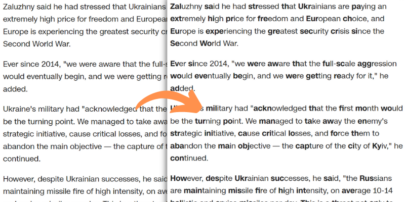

# Bread - an open-source Bionic Reading userscript

Configurable options:

- Minimum word length - the minimum length of a word to be "bionified"
- Minimum text length - the minimum length of a paragraph to be "bionified"
- Bold ratio - the percentage of letters in each word that will be bolded

For more info, check out https://bionic-reading.com/.

This script is intened to work with most websites in alphabetic languages
